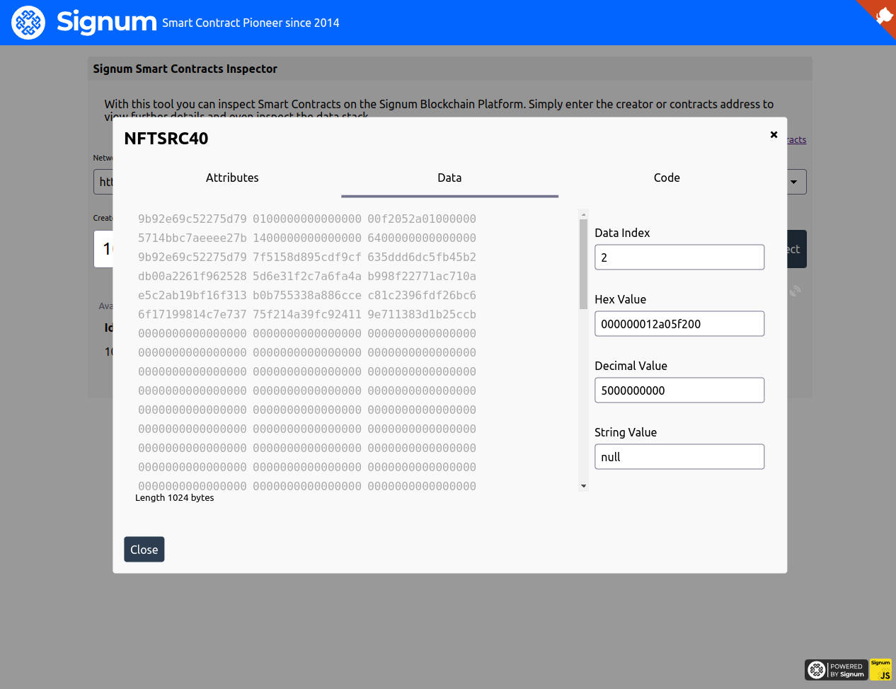

#### Signum Smart Contract Inspector

This handy tool allows to inspect [Signum Smart Contracts](https://github.com/signum-network/signum-smartj)
and allows detailed inspection. This tool is mostly for smart contract developers who want to inspect the current 
data stack of a contract.

[Go to live app](https://signum-contract-inspector.vercel.app//)

Run the `index.html` in any static file server.

Using [serve](https://www.npmjs.com/package/serve) may be the easiest way:

1. `npm i -g serve`
2. `cd ./web/vanilla/contracts-inspector`
3. `serve`
4. Open browser at given url, i.e. `http://localhost:5000`

Additional Url parameters

- address: A Signum Address or Account Id of either a creator or contract
- testnet: If passed the testnet will be chosen, otherwise mainnet
- node: You can add node to be preselected, which can either be a custom one, i.e. `https://foo.signum.network`, or one of the featured nodes, i.e. `https://brazil.signum.network`

Examples:

1. List all contracts of account `TS-QAJA-QW5Y-SWVP-4RVP4` in testnet

`https://signum-contract-inspector.vercel.app/?address=TS-QAJA-QW5Y-SWVP-4RVP4&testnet`

2. Shows the details of contract `10904650711172151453` in a custom node

`https://signum-contract-inspector.vercel.app/?address=10904650711172151453&node=https://lootboy.signum.network`
